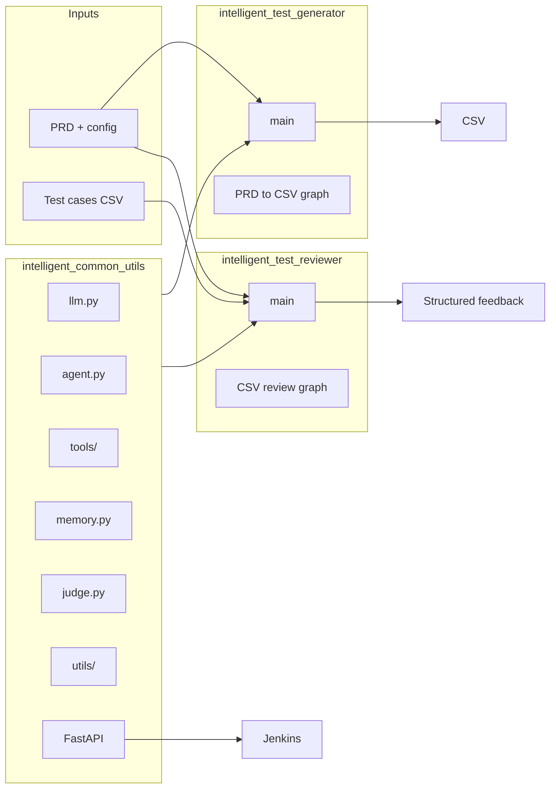

# Complete Framework Plan (Rules-Driven)

## Architecture




- **intelligent_common_utils**: Shared agent core (LLM, tools, memory, judge), config, Postgres, LangSmith, FastAPI for Jenkins. Other modules depend on it only; no duplicate LangChain/LangGraph setup.
- **intelligent_test_generator**: Reads PRD + config from `resources/` (or config path), uses common agent/graph + prompts to produce **CSV** per [testCase_template.mdc](.cursor/rules/testCase_template.mdc).
- **intelligent_test_reviewer**: Reads PRD + config + generator CSV, uses common agent/graph to produce **structured feedback** (Pydantic) on test cases.

---

## 1. Workspace-level setup (code style and tooling)

- Add **pyproject.toml** at repo root:
  - Black: line-length 100, target-version py310.
  - Flake8 or Ruff: max-line-length 100, select PEP8-relevant rules; exclude `venv`, `.cursor`, `k8s`.
  - Optional: Pylint config if preferred over Flake8.
- Add **.pre-commit-config.yaml** (optional): run Black + linter on `*.py`.
- Root **requirements.txt** already matches [TECH_STACK_VERSIONS.mdc](.cursor/rules/TECH_STACK_VERSIONS.mdc); add **black**, **flake8** (or **ruff**) for dev. Each module can have its own `requirements.txt` that pins the same stack and adds only module-specific deps.

Ensures [code_style_guide.mdc](.cursor/rules/code_style_guide.mdc) items 13–14 (PEP8, Black, flake8/Pylint) and line length 100.

---

## 2. intelligent_common_utils

Implements [project_structure.mdc](.cursor/project_structure.mdc) “standard Python with Docker” layout and [modular_agentic_rules.mdc](.cursor/rules/modular_agentic_rules.mdc) components; versions and ownership per [TECH_STACK_VERSIONS.mdc](.cursor/rules/TECH_STACK_VERSIONS.mdc).

**Directory layout (per project_structure):**

```
intelligent_common_utils/
├── src/
│   └── agent_core/
│       ├── __init__.py
│       ├── main.py
│       ├── agent.py
│       ├── llm.py
│       ├── memory.py
│       ├── judge.py
│       ├── tools/
│       │   ├── __init__.py
│       │   └── (e.g. search.py, prd_loader.py – extendable)
│       └── utils/
│           ├── __init__.py
│           ├── config.py
│           ├── db.py
│           ├── tracing.py
│           └── retry.py
├── resources/
│   └── (optional default configs)
├── config/
├── tests/
├── k8s/
│   ├── deployment.yaml
│   └── service.yaml
├── Dockerfile
├── requirements.txt
└── README.md
```

**Key files and responsibilities:**

- **llm.py**
  - Generic interface (e.g. protocol or ABC) for “chat LLM”; implementation that wraps `langchain_openai.ChatOpenAI` with **model default `gpt-4o-mini`** (overridable via config/env). No hardcoded higher-cost models ([TECH_STACK_VERSIONS](.cursor/rules/TECH_STACK_VERSIONS.mdc)).
- **agent.py**
  - Load config (from `resources` or path), init LLM (from llm.py), tools, memory, judge; run interaction loop (or expose invokable graph). Use **async** for I/O ([code_style_guide](.cursor/rules/code_style_guide.mdc) #20).
- **tools/**
  - Async tools (e.g. PRD read, config read); extensible so generator/reviewer can register or use shared tools. Each tool with docstrings and narrow return types ([code_style_guide](.cursor/rules/code_style_guide.mdc) #6).
- **memory.py**
  - Conversation history persistence (e.g. JSON file or Postgres later); used by agent for context.
- **judge.py**
  - Self-critique: review model output and decide retry/accept; callable from agent loop or graph node.
- **utils/config.py**
  - Load YAML/JSON config from `resources` or given path; Pydantic settings for model id, API keys (env), paths. No hardcoded globals ([code_style_guide](.cursor/rules/code_style_guide.mdc) #16).
- **utils/db.py**
  - Postgres connection helper (async preferred), using **postgres:16** in Docker/k8s per TECH_STACK_VERSIONS.
- **utils/tracing.py**
  - LangSmith setup (env); enable tracing for LangChain/LangGraph runs so generator and reviewer get “comprehensive tracing, debugging, and evaluation” ([code_style_guide](.cursor/rules/code_style_guide.mdc) #22).
- **utils/retry.py**
  - Retry with exponential backoff for external API calls; optional circuit-breaker helper ([code_style_guide](.cursor/rules/code_style_guide.mdc) #24–25).
- **Caching**
  - Use LangChain’s caching (e.g. InMemoryCache or optional Redis/postgres per tech stack) so repeated LLM calls are cached ([code_style_guide](.cursor/rules/code_style_guide.mdc) #21).
- **FastAPI app**
  - Minimal app (e.g. in `main.py` or `api.py`) for Jenkins: health, optional “run generator”/“run reviewer” triggers; request/response as Pydantic models ([TECH_STACK_VERSIONS](.cursor/rules/TECH_STACK_VERSIONS.mdc)).
- **Dockerfile**
  - Multi-stage build; Python 3.10 base. **k8s/** uses `postgres:16` if a DB sidecar or service is needed.

All public functions/classes: **docstrings** (PEP 257), **< 100 chars/line**, **finally** where applicable, **logging** instead of print, **error logging** on exceptions ([code_style_guide](.cursor/rules/code_style_guide.mdc)).

---

## 3. intelligent_test_generator

**Purpose:** Read PRD + config, output **test cases as a single CSV** conforming to [testCase_template.mdc](.cursor/rules/testCase_template.mdc).

**Directory layout:** Same as project_structure (src/agent_core, tests/, config/, resources/, k8s/, generated_testcases/, Dockerfile, requirements.txt).

**Inputs:**

- Configuration that points to the PRD (e.g. path to `resources/PRD.txt` or similar).
- Config under `resources/` or `config/` (no hardcoded paths in code).

**Core behavior:**

- Use **intelligent_common_utils** for: LLM (gpt-4o-mini default), agent/graph, tools (e.g. “read PRD”, “read config”), memory, judge, config loading, tracing, retry.
- **Prompts:** Versioned, modular chat prompts (templates) that take PRD sections and produce one test case per call (or batched), then merge into one CSV ([code_style_guide](.cursor/rules/code_style_guide.mdc) #19).
- **Output schema:** Pydantic model(s) for a **single test case row** matching the CSV columns in testCase_template (ID, Name, Description, Requirement ID, Component/Module, Test Type, Priority, Severity, Pre-requisite, Test Data, Environment, Steps, Expected, Actual Value, Additional Notes, Automation Priority, Automation Status, Owner, Estimated Time (mins), Tags, Defect, Status, Version). Use **LCEL** (prompt | llm | parser) with a Pydantic output parser so output is typed and validated ([code_style_guide](.cursor/rules/code_style_guide.mdc) #17–18).
- **Validation and guardrails:** Validate parser output; retry or repair malformed responses ([code_style_guide](.cursor/rules/code_style_guide.mdc) #26).
- **CSV output:** Write one CSV file (path from config or CLI) with header exactly as in testCase_template; each row = one atomic test. No extra commentary in file ([testCase_template](.cursor/rules/testCase_template.mdc)).
- **main.py:** Parse CLI/config → load PRD → run generator graph/agent → write CSV. Run asynchronously where I/O-bound.

**Tests:** Unit tests using a **fake LLM** (e.g. LangChain’s FakeListChatModel or similar) for deterministic CSV generation tests ([code_style_guide](.cursor/rules/code_style_guide.mdc) #23).

---

## 4. intelligent_test_reviewer

**Purpose:** Read PRD + config + **generator CSV**, output **structured feedback** (not free text) on the test cases.

**Directory layout:** Same as project_structure.

**Inputs:**

- Same config style as generator (PRD path, etc.).
- Path to the **CSV file** produced by intelligent_test_generator (config or CLI).

**Core behavior:**

- Reuse **intelligent_common_utils** (LLM, agent/graph, tools, memory, judge, config, tracing, retry).
- **Structured output:** Pydantic model for “review result” (e.g. per-row or per-file: verdict, issues, suggestions, severity). No raw text as primary output ([TECH_STACK_VERSIONS](.cursor/rules/TECH_STACK_VERSIONS.mdc) – Pydantic for structured output).
- **Prompts:** Modular chat prompts that take PRD + one or more test case rows and produce structured review (parsed via LCEL + Pydantic).
- **Flow:** Load PRD and CSV → iterate or batch test cases → run review chain/graph → collect Pydantic results → write output (JSON/CSV or both, as defined in a small schema).
- **main.py:** CLI/config → load PRD + CSV → run reviewer → write structured feedback file.

**Tests:** Unit tests with **fake LLM** for deterministic review output ([code_style_guide](.cursor/rules/code_style_guide.mdc) #23).

---

## 5. Cross-cutting (code_style_guide and TECH_STACK)

- **Line length:** 100 everywhere; Black + linter enforced.
- **Docstrings:** All public functions/classes (PEP 257).
- **Types:** Return narrowest type, accept broadest; use TypedDict/Pydantic/Annotated per TECH_STACK_VERSIONS.
- **Async:** Use async for LLM calls, file I/O, DB, and API endpoints.
- **No sleep():** Use polling/wait utilities where needed ([code_style_guide](.cursor/rules/code_style_guide.mdc) #10).
- **Logging:** Logger throughout; log errors on exceptions ([code_style_guide](.cursor/rules/code_style_guide.mdc) #11–12).
- **Retry and resilience:** Exponential backoff for OpenAI/external calls; optional circuit breaker in common_utils ([code_style_guide](.cursor/rules/code_style_guide.mdc) #24–25).
- **Guardrails:** Validate and retry malformed LLM outputs in both generator and reviewer ([code_style_guide](.cursor/rules/code_style_guide.mdc) #26).
- **Config:** All three modules read from config files (resources/ or config/); no hardcoded globals in code or tests ([code_style_guide](.cursor/rules/code_style_guide.mdc) #16).

---

## 6. Implementation order

1. **Workspace:** Add `pyproject.toml` (Black + flake8/ruff), extend root `requirements.txt` with dev tools.
2. **intelligent_common_utils:** Implement `src/agent_core` (llm.py, agent.py, memory.py, judge.py, tools/, utils/), config schema, optional FastAPI app, Dockerfile, k8s (Postgres 16), README. Add unit tests with fake LLM where applicable.
3. **intelligent_test_generator:** Create module layout; implement Pydantic model for test case row (testCase_template columns); implement prompts and LCEL pipeline; integrate common_utils; CSV writer; main entrypoint; unit tests with fake LLM.
4. **intelligent_test_reviewer:** Create module layout; implement Pydantic model for review feedback; implement review prompts and LCEL; integrate common_utils; reader for generator CSV; main entrypoint; unit tests with fake LLM.
5. **Integration:** Optional end-to-end script or FastAPI route that runs generator then reviewer; document how to run each module in isolation and together.

---

## 7. File and schema references

- **Test case CSV columns (exact header):**  
`ID,Name,Description,Requirement ID,Component/Module,Test Type,Priority,Severity,Pre-requisite,Test Data,Environment,Steps,Expected,Actual Value,Additional Notes,Automation Priority,Automation Status,Owner,Estimated Time (mins),Tags,Defect,Status,Version`
- **ID format:** `TC-{REQ_OR_AREA}-{NNN}` (e.g. `TC-LOGIN-001`).
- **Test Type:** One of `Functional`, `Negative`, `Performance`, `Accessibility`.
- **Priority:** `P0`–`P3`; **Severity:** `S1`–`S4` (optional).
- **Test Group (template):** One of `Smoke`, `Full`, `Comprehensive` (map into schema if column exists; template text says “Test Group” but header says “Test Type” – align header with template or add column per template).

(If the final CSV header is to match testCase_template verbatim, add a **Test Group** column in the defined order and keep **Test Type**; confirm column order from the rule and implement the Pydantic model to match.)

---

## 8. Summary


| Area               | Source                         | Action                                                                                      |
| ------------------ | ------------------------------ | ------------------------------------------------------------------------------------------- |
| Structure          | project_structure, TECH_STACK  | Three modules; common_utils first; each with src/agent_core, tests, config, k8s, Dockerfile |
| Agent core         | modular_agentic_rules          | agent.py, llm.py, tools/, memory.py, judge.py in common_utils; generator/reviewer use them  |
| Versions & LLM     | TECH_STACK_VERSIONS            | Python 3.10, pinned libs, gpt-4o-mini default, Postgres 16, Pydantic/FastAPI                |
| Style & resilience | code_style_guide               | Black/flake8, 100 chars, docstrings, async, retry, guardrails, fake LLM tests, logging      |
| Generator output   | testCase_template              | Single CSV, exact columns, Pydantic row model, LCEL + parser                                |
| Reviewer output    | project_structure + TECH_STACK | Structured feedback (Pydantic), not free text                                               |


This plan yields a complete framework that complies with all five referenced rules and can be built in the order above.